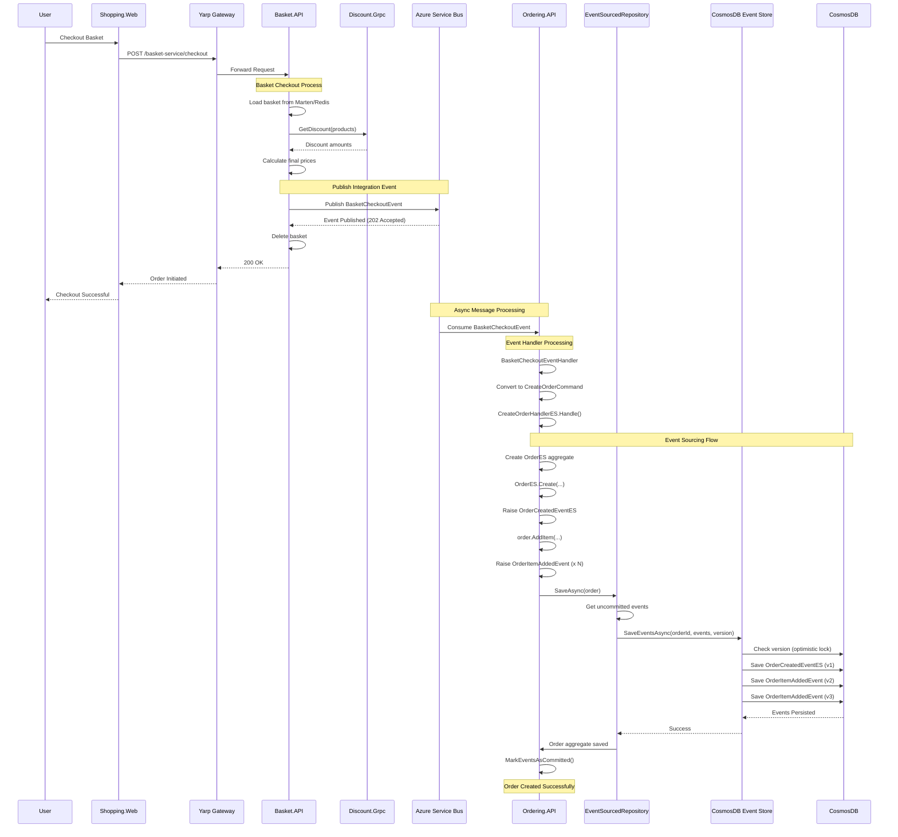
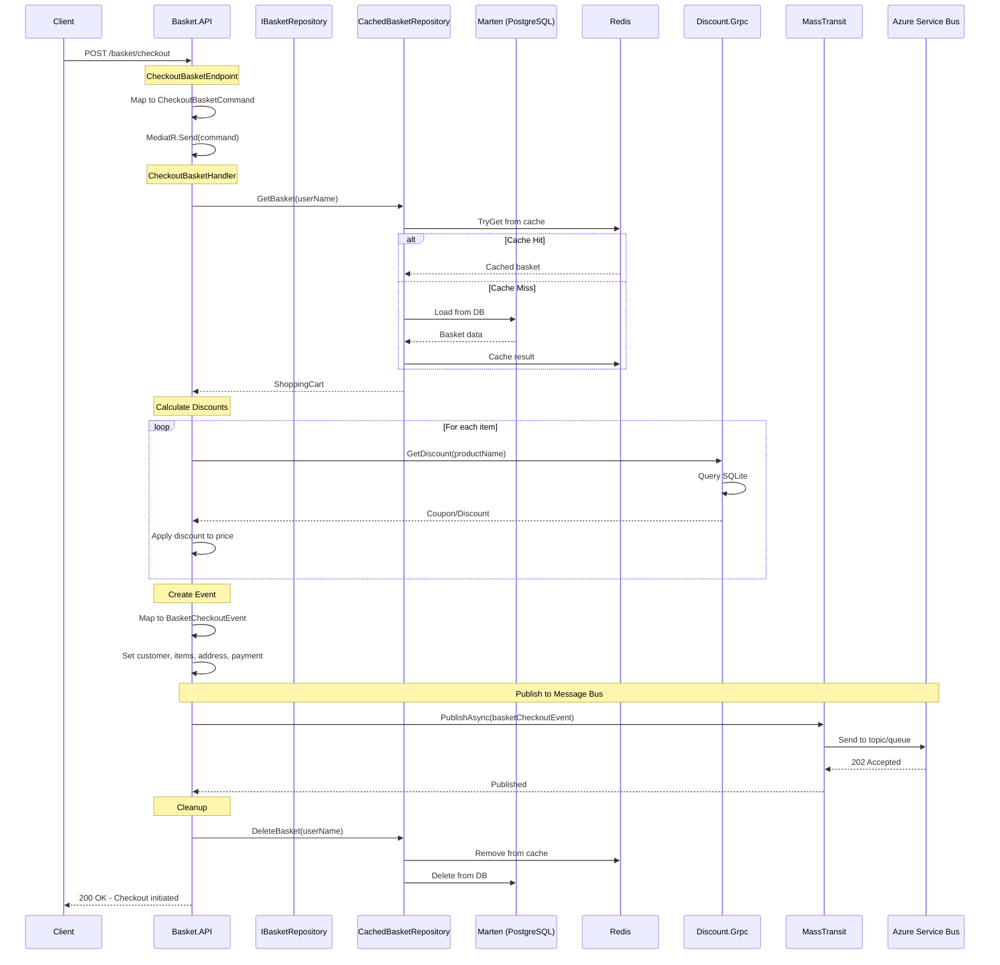
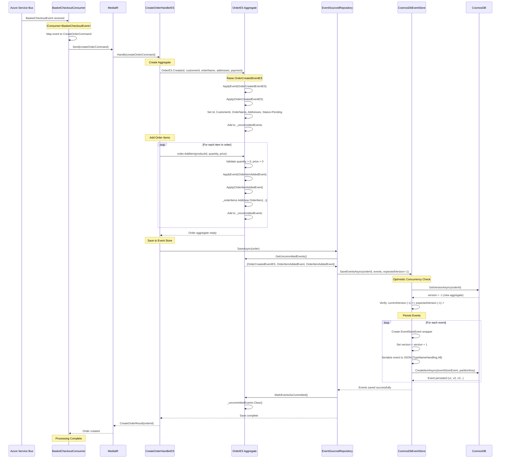
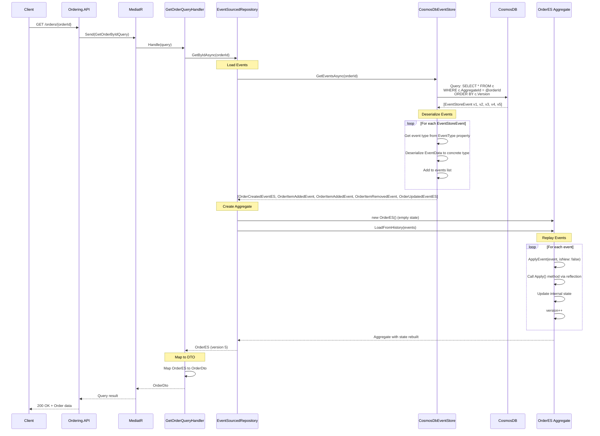
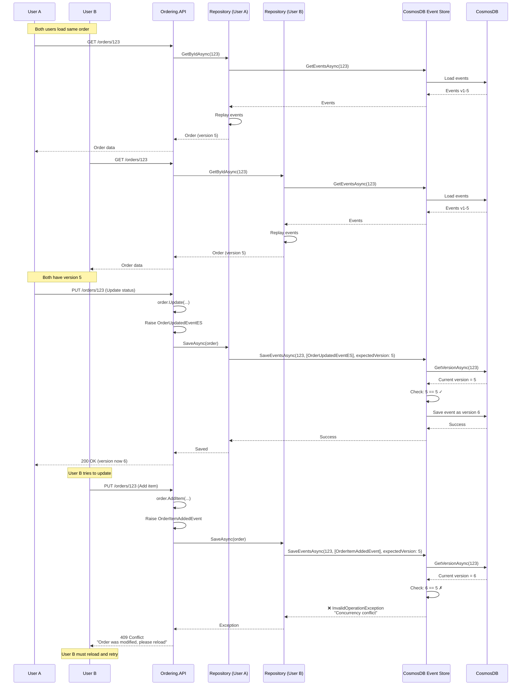

# Event Sourcing - Complete Guide

## Table of Contents
1. [What is Event Sourcing?](#what-is-event-sourcing)
2. [Traditional CRUD vs Event Sourcing](#traditional-crud-vs-event-sourcing)
3. [Event Sourcing Architecture](#event-sourcing-architecture)
4. [Sequence Diagrams - Complete Flows](#sequence-diagrams---complete-flows)
5. [Event Flow: Creating an Order](#event-flow-creating-an-order)
6. [Rebuilding State (Event Replay)](#rebuilding-state-event-replay)
7. [Updating an Order](#updating-an-order)
8. [Event Types](#event-types)
9. [Benefits of Event Sourcing](#benefits-of-event-sourcing)
10. [Trade-offs](#trade-offs)
11. [When to Use Event Sourcing](#when-to-use-event-sourcing)
12. [Implementation Summary](#implementation-summary)

---

## What is Event Sourcing?

**Event Sourcing** is an architectural pattern where you store all changes to application state as a sequence of immutable events, rather than storing just the current state. Instead of updating records, you append events that describe what happened.

### Core Principles

- **Events are immutable** - Once written, they never change
- **Events are the source of truth** - Current state is derived from events
- **Complete audit trail** - Every change is recorded forever
- **Time travel** - Can reconstruct state at any point in time

---

## Traditional CRUD vs Event Sourcing

### Traditional CRUD Approach

```
Database Table: Orders
┌──────────┬──────────┬────────────┬────────┬─────────────┐
│ OrderId  │ Customer │ TotalPrice │ Status │ LastUpdated │
├──────────┼──────────┼────────────┼────────┼─────────────┤
│ 123      │ John     │ $150       │ Shipped│ 2025-01-15  │
└──────────┴──────────┴────────────┴────────┴─────────────┘

❌ Lost Information:
- When was the order created?
- What was the original price?
- Who changed the status from "Pending" to "Shipped"?
- What items were added/removed?
- Complete audit trail is GONE!
```

### Event Sourcing Approach

```
Event Store: OrderEvents (CosmosDB)
┌─────────┬────────────────────────┬─────────┬───────────────────────┐
│ Version │ Event Type             │ OrderId │ Event Data            │
├─────────┼────────────────────────┼─────────┼───────────────────────┤
│    1    │ OrderCreatedEventES    │ 123     │ {Customer: "John"...} │
│    2    │ OrderItemAddedEvent    │ 123     │ {ProductId: 456...}   │
│    3    │ OrderItemAddedEvent    │ 123     │ {ProductId: 789...}   │
│    4    │ OrderItemRemovedEvent  │ 123     │ {ProductId: 456...}   │
│    5    │ OrderUpdatedEventES    │ 123     │ {Status: "Shipped"...}│
└─────────┴────────────────────────┴─────────┴───────────────────────┘

✅ Complete History:
- Every state change is recorded
- Full audit trail preserved
- Can rebuild state at any point in time
- Can analyze what happened and when
```

---

## Event Sourcing Architecture

### Overall Architecture

```
┌─────────────────────────────────────────────────────────────────┐
│                    Application Layer                             │
│                                                                  │
│  ┌──────────────────────┐        ┌──────────────────────┐      │
│  │ CreateOrderHandlerES │        │ UpdateOrderHandlerES │      │
│  └──────────┬───────────┘        └──────────┬───────────┘      │
│             │                               │                   │
│             │ Uses                          │ Uses              │
│             ▼                               ▼                   │
│  ┌────────────────────────────────────────────────────┐        │
│  │     IEventSourcedRepository<OrderES>               │        │
│  │     (Interface in BuildingBlocks)                  │        │
│  └─────────────────────┬──────────────────────────────┘        │
└────────────────────────┼─────────────────────────────────────────┘
                         │
                         │ Implemented by
                         ▼
┌─────────────────────────────────────────────────────────────────┐
│                  Infrastructure Layer                            │
│                                                                  │
│  ┌────────────────────────────────────────────────────┐        │
│  │      EventSourcedRepository<OrderES>               │        │
│  │      - GetByIdAsync() → Loads events               │        │
│  │      - SaveAsync() → Persists events               │        │
│  └──────────────────┬─────────────────────────────────┘        │
│                     │                                           │
│                     │ Uses                                      │
│                     ▼                                           │
│  ┌────────────────────────────────────────────────────┐        │
│  │           CosmosDbEventStore                       │        │
│  │           - SaveEventsAsync()                      │        │
│  │           - GetEventsAsync()                       │        │
│  │           - GetVersionAsync()                      │        │
│  └──────────────────┬─────────────────────────────────┘        │
│                     │                                           │
│                     │ Persists to                               │
│                     ▼                                           │
│  ┌────────────────────────────────────────────────────┐        │
│  │         Azure CosmosDB                             │        │
│  │   Database: OrderEventStore                        │        │
│  │   Container: OrderEvents                           │        │
│  │   Partition Key: AggregateId (Order ID)            │        │
│  └────────────────────────────────────────────────────┘        │
└─────────────────────────────────────────────────────────────────┘
```

### Key Components

#### 1. EventSourcedAggregate (Base Class)
- Tracks uncommitted events
- Applies events to rebuild state
- Version tracking for optimistic concurrency

#### 2. IEventStore (Interface)
- `SaveEventsAsync()` - Persists events with version checking
- `GetEventsAsync()` - Retrieves event stream for an aggregate
- `GetVersionAsync()` - Gets current aggregate version

#### 3. CosmosDbEventStore (Implementation)
- Stores events as EventStoreEvent documents
- Partitioned by AggregateId for efficient queries
- Serializes events with full type information

#### 4. OrderES (Domain Aggregate)
- Inherits from EventSourcedAggregate
- Raises granular events
- Apply() methods rebuild state from events

---

## Sequence Diagrams - Complete Flows

### 1. End-to-End: Basket Checkout to Order Creation

This diagram shows the complete flow from basket checkout through Azure Service Bus to order creation with Event Sourcing.

#### Mermaid Diagram



#### ASCII Diagram

```
┌──────┐                                                    ┌──────────────┐
│ User │                                                    │ Shopping.Web │
└───┬──┘                                                    └──────┬───────┘
    │                                                              │
    │ 1. Checkout Basket                                          │
    │─────────────────────────────────────────────────────────────>
    │                                                              │
    │                                          ┌──────────────────▼─────┐
    │                                          │   Yarp API Gateway     │
    │                                          └──────────┬─────────────┘
    │                                                     │
    │                                          ┌──────────▼─────────────┐
    │                                          │     Basket.API         │
    │                                          └──────────┬─────────────┘
    │                                                     │
    │                                                     │ 2. Load basket
    │                                                     │ 3. Get discounts
    │                                          ┌──────────▼─────────────┐
    │                                          │   Discount.Grpc        │
    │                                          └──────────┬─────────────┘
    │                                                     │
    │                                                     │ 4. Return discounts
    │                                          ┌──────────▼─────────────┐
    │                                          │     Basket.API         │
    │                                          └──────────┬─────────────┘
    │                                                     │
    │                                                     │ 5. Calculate final prices
    │                                                     │ 6. Publish Event
    │                                          ┌──────────▼─────────────┐
    │                                          │ Azure Service Bus      │
    │                                          └──────────┬─────────────┘
    │                                                     │
    │                                                     │ ASYNC
    │                                                     │
    │                                          ┌──────────▼─────────────┐
    │                                          │   Ordering.API         │
    │                                          └──────────┬─────────────┘
    │                                                     │
    │                                                     │ 7. Consume Event
    │                                                     │ 8. Create OrderES
    │                                                     │ 9. Raise Events:
    │                                                     │    - OrderCreatedEventES
    │                                                     │    - OrderItemAddedEvent (x N)
    │                                          ┌──────────▼─────────────┐
    │                                          │ EventSourcedRepository │
    │                                          └──────────┬─────────────┘
    │                                                     │
    │                                                     │ 10. SaveAsync()
    │                                          ┌──────────▼─────────────┐
    │                                          │ CosmosDB Event Store   │
    │                                          └──────────┬─────────────┘
    │                                                     │
    │                                                     │ 11. Check version
    │                                                     │ 12. Persist events
    │                                          ┌──────────▼─────────────┐
    │                                          │   Azure CosmosDB       │
    │                                          │   Container: OrderEvents│
    │                                          └────────────────────────┘
```

---

### 2. Basket Checkout Flow (Detailed)



---

### 3. Order Creation with Event Sourcing (Detailed)



---

### 4. Order Query Flow (Event Replay)



---

### 5. Concurrent Update with Optimistic Locking



---

### 6. Complete System Integration

```
┌─────────────────────────────────────────────────────────────────────┐
│                         Complete E-Commerce Flow                     │
└─────────────────────────────────────────────────────────────────────┘

    ┌──────┐
    │ User │
    └───┬──┘
        │
        │ 1. Browse Products
        ▼
    ┌────────────────┐
    │ Shopping.Web   │──────────┐
    └───────┬────────┘          │
            │                   │ 2. Add to Basket
            ▼                   ▼
    ┌──────────────────────────────┐
    │   Yarp API Gateway           │
    │   - Routing                  │
    │   - Rate Limiting            │
    └───────┬──────────────────────┘
            │
            ├────────────────────────────────┬──────────────────┐
            │                                │                  │
            ▼                                ▼                  ▼
    ┌───────────────┐            ┌──────────────┐    ┌─────────────┐
    │  Catalog.API  │            │ Basket.API   │    │Ordering.API │
    │  (Vertical    │            │ (Repository  │    │ (DDD + ES)  │
    │   Slice)      │            │  + Decorator)│    │             │
    └───────┬───────┘            └──────┬───────┘    └──────┬──────┘
            │                           │                    │
            │ CQRS/MediatR              │ gRPC               │ Event
            ▼                           │                    │ Sourcing
    ┌───────────────┐                  │                    │
    │   Marten      │                  │                    ▼
    │ (PostgreSQL)  │                  │            ┌───────────────┐
    └───────────────┘                  │            │   CosmosDB    │
                                       │            │  Event Store  │
                                       ▼            └───────────────┘
                              ┌─────────────────┐
                              │ Discount.Grpc   │
                              │ (SQLite)        │
                              └─────────────────┘
                                       │
                        3. Get Discounts│
                                       │
                                       ▼
                              ┌─────────────────┐
                              │  Basket.API     │
                              │  Checkout       │
                              └────────┬────────┘
                                       │
                        4. Publish Event│
                                       ▼
                              ┌─────────────────┐
                              │ Azure Service   │
                              │     Bus         │
                              │ (MassTransit)   │
                              └────────┬────────┘
                                       │
                        5. Consume Event│
                                       ▼
                              ┌─────────────────┐
                              │ Ordering.API    │
                              │ Event Handler   │
                              └────────┬────────┘
                                       │
                     6. Create OrderES  │
                     7. Raise Events    │
                                       ▼
                        ┌──────────────────────────┐
                        │ EventSourcedRepository   │
                        └──────────┬───────────────┘
                                   │
                     8. Save Events│
                                   ▼
                        ┌──────────────────────────┐
                        │ CosmosDB Event Store     │
                        │ - Version Check          │
                        │ - Persist Events         │
                        └──────────┬───────────────┘
                                   │
                        9. Events  │
                           Stored  ▼
                        ┌──────────────────────────┐
                        │   Azure CosmosDB         │
                        │   Container: OrderEvents │
                        │   ┌────────────────────┐ │
                        │   │ OrderCreatedEventES│ │
                        │   │ OrderItemAddedEvent│ │
                        │   │ OrderItemAddedEvent│ │
                        │   └────────────────────┘ │
                        └──────────────────────────┘
```

---

## Event Flow: Creating an Order

### Step-by-Step Flow

```
1. HTTP Request
   │
   ▼
┌──────────────────────────────────────────────────────────────┐
│ POST /api/orders                                             │
│ Body: { customerId, items: [...], address: {...} }          │
└────────────────────────┬─────────────────────────────────────┘
                         │
                         ▼
2. CreateOrderHandlerES.Handle()
   │
   ├─► Create new OrderES aggregate
   │   OrderES.Create(id, customerId, orderName, address...)
   │
   ├─► Add items to order
   │   order.AddItem(productId, quantity, price)
   │   order.AddItem(productId, quantity, price)
   │
   └─► Save to Event Store
       repository.SaveAsync(order)
                         │
                         ▼
3. OrderES Aggregate State
   │
   ├─► Raises Events (in memory):
   │   - OrderCreatedEventES (version 1)
   │   - OrderItemAddedEvent (version 2)
   │   - OrderItemAddedEvent (version 3)
   │
   └─► Uncommitted Events List:
       [OrderCreatedEventES, OrderItemAddedEvent, OrderItemAddedEvent]
                         │
                         ▼
4. EventSourcedRepository.SaveAsync()
   │
   ├─► Get uncommitted events from aggregate
   │
   └─► Call EventStore.SaveEventsAsync(aggregateId, events, version)
                         │
                         ▼
5. CosmosDbEventStore.SaveEventsAsync()
   │
   ├─► Check optimistic concurrency
   │   currentVersion = GetVersionAsync(aggregateId)
   │   if (currentVersion != expectedVersion) → THROW EXCEPTION
   │
   ├─► For each event:
   │   │
   │   ├─► Create EventStoreEvent wrapper:
   │   │   {
   │   │     Id: Guid,
   │   │     AggregateId: orderId,
   │   │     EventType: "OrderCreatedEventES",
   │   │     EventData: JSON serialized event,
   │   │     Version: 1,
   │   │     Timestamp: UTC now,
   │   │     PartitionKey: orderId.ToString()
   │   │   }
   │   │
   │   └─► Persist to CosmosDB
   │       container.CreateItemAsync(eventStoreEvent)
   │
   └─► Mark events as committed
       aggregate.MarkEventsAsCommitted()
                         │
                         ▼
6. CosmosDB Storage
┌─────────────────────────────────────────────────────────────┐
│ Container: OrderEvents                                      │
│ Partition: order-123-guid                                   │
│                                                             │
│ Document 1:                                                 │
│ {                                                           │
│   id: "event-guid-1",                                       │
│   aggregateId: "order-123-guid",                            │
│   eventType: "OrderCreatedEventES",                         │
│   eventData: "{customerId: ..., orderName: ...}",          │
│   version: 1,                                               │
│   timestamp: "2025-01-15T10:00:00Z"                         │
│ }                                                           │
│                                                             │
│ Document 2:                                                 │
│ {                                                           │
│   id: "event-guid-2",                                       │
│   aggregateId: "order-123-guid",                            │
│   eventType: "OrderItemAddedEvent",                         │
│   eventData: "{productId: 456, quantity: 2, price: 50}",   │
│   version: 2,                                               │
│   timestamp: "2025-01-15T10:00:01Z"                         │
│ }                                                           │
└─────────────────────────────────────────────────────────────┘
```

---

## Rebuilding State (Event Replay)

### Loading an Order from Event Store

```
1. Request Order
   │
   ▼
repository.GetByIdAsync(orderId)
   │
   ▼
2. Load Events from CosmosDB
   │
   ├─► Query: SELECT * FROM c
   │          WHERE c.AggregateId = @orderId
   │          ORDER BY c.Version
   │
   └─► Returns: [Event1, Event2, Event3, Event4, Event5]
   │
   ▼
3. Create Empty Aggregate
   │
   var order = new OrderES()
   // State is completely empty!
   │
   ▼
4. Replay Events (Rebuild State)
   │
   order.LoadFromHistory([Event1, Event2, Event3, Event4, Event5])
   │
   ├─► Apply Event 1: OrderCreatedEventES
   │   │
   │   └─► Call: Apply(OrderCreatedEventES event)
   │       {
   │         Id = event.OrderId;
   │         CustomerId = event.CustomerId;
   │         OrderName = event.OrderName;
   │         ShippingAddress = ...;
   │         Status = Pending;
   │       }
   │
   ├─► Apply Event 2: OrderItemAddedEvent
   │   │
   │   └─► Call: Apply(OrderItemAddedEvent event)
   │       {
   │         _orderItems.Add(new OrderItem(...));
   │       }
   │
   ├─► Apply Event 3: OrderItemAddedEvent
   │   │
   │   └─► Call: Apply(OrderItemAddedEvent event)
   │       {
   │         _orderItems.Add(new OrderItem(...));
   │       }
   │
   ├─► Apply Event 4: OrderItemRemovedEvent
   │   │
   │   └─► Call: Apply(OrderItemRemovedEvent event)
   │       {
   │         var item = _orderItems.Find(...);
   │         _orderItems.Remove(item);
   │       }
   │
   └─► Apply Event 5: OrderUpdatedEventES
       │
       └─► Call: Apply(OrderUpdatedEventES event)
           {
             Status = event.Status;
             OrderName = event.OrderName;
             ...
           }
   │
   ▼
5. Final State
┌──────────────────────────────────────────────────────────┐
│ OrderES (Current State)                                  │
│ ─────────────────────────────────────────────────────── │
│ Id: order-123-guid                                       │
│ CustomerId: customer-456-guid                            │
│ OrderName: "John's Order"                                │
│ Status: Shipped                                          │
│ OrderItems: [                                            │
│   { ProductId: 789, Quantity: 1, Price: 100 }           │
│ ]                                                        │
│ Version: 5                                               │
│ TotalPrice: $100                                         │
└──────────────────────────────────────────────────────────┘

✅ State perfectly reconstructed from events!
```

### Code Example: Apply Methods

```csharp
// Apply method for OrderCreatedEventES
private void Apply(OrderCreatedEventES @event)
{
    Id = @event.OrderId;
    CustomerId = CustomerId.Of(@event.CustomerId);
    OrderName = OrderName.Of(@event.OrderName);
    ShippingAddress = Address.Of(
        @event.ShippingFirstName,
        @event.ShippingLastName,
        @event.ShippingEmailAddress,
        @event.ShippingAddressLine,
        @event.ShippingCountry,
        @event.ShippingState,
        @event.ShippingZipCode);
    Status = OrderStatus.Pending;
}

// Apply method for OrderItemAddedEvent
private void Apply(OrderItemAddedEvent @event)
{
    var orderItem = new OrderItem(
        OrderId.Of(@event.OrderId),
        ProductId.Of(@event.ProductId),
        @event.Quantity,
        @event.Price);
    _orderItems.Add(orderItem);
}
```

---

## Updating an Order

### Update Flow with Optimistic Concurrency

```
Two users try to update the same order simultaneously:

User A                           User B
  │                                │
  ├─► Load Order (version 5)      ├─► Load Order (version 5)
  │                                │
  ├─► order.Update(...)            ├─► order.AddItem(...)
  │   Raises OrderUpdatedEventES   │   Raises OrderItemAddedEvent
  │                                │
  ├─► Save (expects version 5)    │
  │   ✅ SUCCESS                    │
  │   Saves as version 6           │
  │                                ├─► Save (expects version 5)
  │                                │   ❌ CONFLICT!
  │                                │   Current version is 6
  │                                │
  │                                └─► Exception thrown:
  │                                    "Concurrency conflict"
  │
  ▼                                ▼
Saved Successfully              Must reload and retry
```

### Concurrency Check in Code

```csharp
public async Task SaveEventsAsync<T>(
    Guid aggregateId,
    IEnumerable<object> events,
    int expectedVersion,  // The version User B thinks it is
    CancellationToken cancellationToken = default)
{
    // Check current version in database
    var currentVersion = await GetVersionAsync(aggregateId);

    if (currentVersion != expectedVersion)
    {
        throw new InvalidOperationException(
            $"Concurrency conflict for aggregate {aggregateId}. " +
            $"Expected version {expectedVersion}, " +
            $"but current version is {currentVersion}");
    }

    // Safe to save events...
}
```

---

## Event Types

### Domain Events in Your System

```
OrderES Aggregate Events
├── OrderCreatedEventES
│   ├─ OrderId
│   ├─ CustomerId
│   ├─ OrderName
│   ├─ ShippingAddress (all fields)
│   ├─ BillingAddress (all fields)
│   └─ Payment (all fields)
│
├── OrderItemAddedEvent
│   ├─ OrderId
│   ├─ ProductId
│   ├─ Quantity
│   └─ Price
│
├── OrderItemRemovedEvent
│   ├─ OrderId
│   └─ ProductId
│
└── OrderUpdatedEventES
    ├─ OrderId
    ├─ OrderName
    ├─ ShippingAddress (all fields)
    ├─ BillingAddress (all fields)
    ├─ Payment (all fields)
    └─ Status
```

### Example Event Data in CosmosDB

```json
{
  "id": "550e8400-e29b-41d4-a716-446655440001",
  "aggregateId": "123e4567-e89b-12d3-a456-426614174000",
  "aggregateType": "OrderES",
  "eventType": "OrderCreatedEventES",
  "eventData": "{\"OrderId\":\"123e4567-e89b-12d3-a456-426614174000\",\"CustomerId\":\"789...\",\"OrderName\":\"John's Order\",\"ShippingFirstName\":\"John\",\"ShippingLastName\":\"Doe\",\"ShippingEmailAddress\":\"john@example.com\",\"ShippingAddressLine\":\"123 Main St\",\"ShippingCountry\":\"USA\",\"ShippingState\":\"CA\",\"ShippingZipCode\":\"90210\",\"BillingFirstName\":\"John\",\"BillingLastName\":\"Doe\",\"BillingEmailAddress\":\"john@example.com\",\"BillingAddressLine\":\"123 Main St\",\"BillingCountry\":\"USA\",\"BillingState\":\"CA\",\"BillingZipCode\":\"90210\",\"CardName\":\"John Doe\",\"CardNumber\":\"****1234\",\"Expiration\":\"12/25\",\"CVV\":\"***\",\"PaymentMethod\":1}",
  "version": 1,
  "timestamp": "2025-01-15T10:30:00.000Z",
  "partitionKey": "123e4567-e89b-12d3-a456-426614174000"
}
```

---

## Benefits of Event Sourcing

### 1. Complete Audit Trail

```
Question: "What was the order total on January 10th?"

Traditional CRUD: 🤷 "No idea, we only have current state"

Event Sourcing:
└─► Replay events up to January 10th
    └─► State at that exact moment: $150
```

### 2. Time Travel Debugging

```
Bug Report: "Order 123 shows wrong total!"

Traditional CRUD:
└─► Look at current state
    └─► "Total is $200... looks right to me?"

Event Sourcing:
└─► View event stream
    ├─► OrderCreatedEventES: $150
    ├─► OrderItemAddedEvent: Product 456, $50
    ├─► OrderItemAddedEvent: Product 789, $100
    ├─► OrderItemRemovedEvent: Product 456 ← AH HA!
    │   (Bug: Removal didn't subtract from total!)
    └─► OrderUpdatedEventES: Status changed
```

### 3. Business Intelligence

```
Analytics Questions:
- "What's our average time from order creation to shipment?"
- "Which products are frequently added then removed?"
- "What percentage of orders are modified before shipping?"

Traditional CRUD: ❌ Cannot answer - history lost

Event Sourcing: ✅ Analyze complete event stream
```

### 4. Event Replay for New Features

```
New Feature: "Calculate customer lifetime value"

Traditional CRUD:
└─► Only have current order totals
    └─► Cannot see historical patterns

Event Sourcing:
└─► Replay ALL customer events from beginning
    └─► Build complete purchasing history
    └─► Accurate lifetime value calculation
```

### 5. Natural Integration with Event-Driven Architecture

Events from Event Sourcing can be published to:
- Azure Service Bus
- Event Grid
- SignalR for real-time notifications
- Analytics pipelines

### 6. Regulatory Compliance

Financial regulations (SOX, GDPR audit requirements) often require:
- **Immutable audit logs** ✅ Events are immutable
- **Complete change history** ✅ Every change captured
- **Who/What/When tracking** ✅ Events include metadata

---

## Trade-offs

### Advantages ✅

| Benefit | Description |
|---------|-------------|
| **Complete Audit Trail** | Every change recorded forever |
| **Temporal Queries** | Query state at any point in time |
| **Event Replay** | Rebuild state or create projections |
| **Natural Event-Driven** | Events can trigger workflows |
| **Debugging** | See exactly what happened and when |
| **Compliance** | Immutable history for regulations |
| **No Data Loss** | Cannot lose historical information |
| **Domain Insights** | Understand business processes better |

### Challenges ⚠️

| Challenge | Mitigation Strategy |
|-----------|---------------------|
| **Complexity** | Start small, provide training |
| **Storage Growth** | Storage is cheap, use snapshots for very old aggregates |
| **Learning Curve** | Good documentation (like this guide!) |
| **Query Complexity** | Use CQRS with separate read models |
| **Schema Evolution** | Version events, use upcasting for old events |
| **Performance** | Use snapshots for aggregates with many events |
| **Eventual Consistency** | Design UI for async operations |

---

## When to Use Event Sourcing

### ✅ Good Use Cases

| Domain | Why Event Sourcing Fits |
|--------|------------------------|
| **Financial Systems** | Complete audit trail required by law |
| **Healthcare** | HIPAA compliance, patient history |
| **E-commerce Orders** | Track full order lifecycle (your implementation!) |
| **Collaborative Editing** | Google Docs-style conflict resolution |
| **Workflow Engines** | State machine transitions |
| **Gaming** | Player actions, achievements |
| **IoT/Telemetry** | Sensor readings over time |
| **Blockchain** | Immutable transaction history |

### ❌ Not Recommended For

| Domain | Why CRUD is Better |
|--------|-------------------|
| **Simple CRUD Apps** | Overkill for basic data |
| **Reference Data** | Product catalogs (current state is enough) |
| **Temporary Data** | Session data, cache entries |
| **Performance-Critical Reads** | Unless using CQRS read models |
| **Rapidly Changing Schemas** | Event schema changes are complex |

### Decision Matrix

```
Use Event Sourcing if you need:
├─► Complete audit trail? → YES
├─► Regulatory compliance? → YES
├─► Time travel queries? → YES
├─► Complex state transitions? → YES
└─► Domain event analysis? → YES

Stick with CRUD if:
├─► Simple data management? → YES
├─► Team unfamiliar with ES? → YES
├─► Read-heavy application? → YES (unless using CQRS)
└─► No audit requirements? → YES
```

---

## Implementation Summary

### Technology Stack

```
Tech Stack:
├── Event Store: Azure CosmosDB
│   ├── Database: OrderEventStore
│   ├── Container: OrderEvents
│   └── Partition Strategy: By AggregateId
│
├── Aggregate: OrderES (Event-Sourced Order)
│   ├── Base Class: EventSourcedAggregate
│   ├── Events: 4 types (Created, Updated, ItemAdded, ItemRemoved)
│   └── State: Rebuilt from events via Apply() methods
│
├── Event Store Implementation: CosmosDbEventStore
│   ├── Serialization: JSON with TypeNameHandling
│   ├── Concurrency: Optimistic locking with version numbers
│   └── Querying: By AggregateId, ordered by Version
│
└── Repository: EventSourcedRepository<OrderES>
    ├── GetByIdAsync: Loads and replays events
    └── SaveAsync: Persists uncommitted events
```

### File Structure

```
BuildingBlocks/BuildingBlocks/EventSourcing/
├── IEventStore.cs                    # Event persistence interface
├── EventStoreEvent.cs                # Event wrapper with metadata
├── IEventSourcedAggregate.cs         # Aggregate interface
├── EventSourcedAggregate.cs          # Base aggregate class
└── IEventSourcedRepository.cs        # Repository interface

Ordering.Domain/
├── Models/
│   └── OrderES.cs                    # Event-sourced aggregate
└── Events/
    ├── OrderCreatedEventES.cs
    ├── OrderUpdatedEventES.cs
    ├── OrderItemAddedEvent.cs
    └── OrderItemRemovedEvent.cs

Ordering.Infrastructure/EventStore/
├── CosmosDbEventStore.cs             # CosmosDB implementation
├── EventSourcedRepository.cs         # Repository implementation
└── CosmosDbSetup.cs                  # Database initialization

Ordering.Application/Orders/Commands/
├── CreateOrder/
│   └── CreateOrderHandlerES.cs       # Event-sourced handler
└── UpdateOrder/
    └── UpdateOrderHandlerES.cs       # Event-sourced handler
```

### Configuration Required

```json
{
  "CosmosDb": {
    "Endpoint": "https://<your-account>.documents.azure.com:443/",
    "Key": "<your-primary-key>",
    "DatabaseName": "OrderEventStore",
    "ContainerName": "OrderEvents"
  }
}
```

### Key Classes and Methods

#### EventSourcedAggregate

```csharp
public abstract class EventSourcedAggregate : IEventSourcedAggregate
{
    public Guid Id { get; protected set; }
    public int Version { get; protected set; } = -1;

    // Get all uncommitted events
    public IEnumerable<object> GetUncommittedEvents();

    // Mark all events as committed
    public void MarkEventsAsCommitted();

    // Load aggregate state from historical events
    public void LoadFromHistory(IEnumerable<object> events);

    // Apply a new event to the aggregate
    protected void ApplyEvent(object @event);
}
```

#### IEventStore

```csharp
public interface IEventStore
{
    // Save events for an aggregate
    Task SaveEventsAsync<T>(
        Guid aggregateId,
        IEnumerable<object> events,
        int expectedVersion,
        CancellationToken cancellationToken = default);

    // Load all events for an aggregate
    Task<IEnumerable<object>> GetEventsAsync(
        Guid aggregateId,
        CancellationToken cancellationToken = default);

    // Get current version of an aggregate
    Task<int> GetVersionAsync(
        Guid aggregateId,
        CancellationToken cancellationToken = default);
}
```

#### IEventSourcedRepository

```csharp
public interface IEventSourcedRepository<T> where T : IEventSourcedAggregate
{
    // Load an aggregate from the event store
    Task<T?> GetByIdAsync(
        Guid aggregateId,
        CancellationToken cancellationToken = default);

    // Save an aggregate to the event store
    Task SaveAsync(
        T aggregate,
        CancellationToken cancellationToken = default);
}
```

---

## Best Practices

### 1. Event Design

✅ **DO:**
- Use past tense for event names (OrderCreated, not CreateOrder)
- Include all necessary data in events
- Keep events immutable
- Version your events

❌ **DON'T:**
- Reference external entities by object (use IDs instead)
- Put business logic in events
- Make events too large
- Change event structure after publishing

### 2. Aggregate Design

✅ **DO:**
- Keep aggregates small and focused
- Use Apply() methods for all state changes
- Validate in business methods, not Apply()
- Use factory methods for creation

❌ **DON'T:**
- Load multiple aggregates in one transaction
- Reference other aggregates by object
- Put queries in aggregates
- Skip validation in business methods

### 3. Performance

✅ **DO:**
- Use snapshots for aggregates with many events
- Partition events by AggregateId
- Cache frequently accessed aggregates
- Use CQRS for complex queries

❌ **DON'T:**
- Load all events every time (use snapshots)
- Query event store for reporting
- Replay thousands of events in hot path
- Ignore version conflicts

### 4. Testing

```csharp
// Test pattern: Given-When-Then
[Fact]
public void AddItem_Should_RaiseOrderItemAddedEvent()
{
    // Given: An existing order
    var order = OrderES.Create(...);

    // When: Adding an item
    order.AddItem(productId, quantity, price);

    // Then: Event is raised
    var events = order.GetUncommittedEvents();
    Assert.Contains(
        events,
        e => e is OrderItemAddedEvent evt
             && evt.ProductId == productId);
}
```

---

## Common Patterns

### 1. Snapshots (Performance Optimization)

For aggregates with many events, create periodic snapshots:

```csharp
// Every 100 events, save a snapshot
if (aggregate.Version % 100 == 0)
{
    await snapshotStore.SaveSnapshotAsync(aggregate);
}

// Load from snapshot instead of replaying all events
var snapshot = await snapshotStore.GetSnapshotAsync(aggregateId);
var events = await eventStore.GetEventsAsync(
    aggregateId,
    fromVersion: snapshot.Version);
```

### 2. CQRS (Query Side)

Event Sourcing is often paired with CQRS:

```
Write Side (Event Sourcing)
├─► Commands modify aggregates
├─► Events are persisted
└─► Optimized for writes

Read Side (CQRS)
├─► Events project to read models
├─► Denormalized for queries
└─► Optimized for reads
```

### 3. Event Upcasting (Schema Evolution)

Handle old event versions:

```csharp
public class EventUpcaster
{
    public object Upcast(EventStoreEvent storedEvent)
    {
        if (storedEvent.EventType == "OrderCreatedEvent_V1")
        {
            var v1 = Deserialize<OrderCreatedEvent_V1>(storedEvent);
            return new OrderCreatedEventES
            {
                // Map old fields to new structure
                OrderId = v1.Id,
                CustomerId = v1.CustomerId,
                OrderName = v1.Name ?? "Unknown",
                // Set defaults for new fields
                ShippingEmailAddress = "unknown@example.com"
            };
        }
        return Deserialize(storedEvent);
    }
}
```

---

## Troubleshooting

### Common Issues

#### 1. Concurrency Conflicts

**Problem:** Multiple users editing same aggregate

**Solution:**
- Implement retry logic
- Use optimistic locking (version checking)
- Show conflict resolution UI

#### 2. Too Many Events

**Problem:** Slow to replay thousands of events

**Solution:**
- Implement snapshots
- Cache aggregates
- Consider archiving very old events

#### 3. Event Schema Changes

**Problem:** Old events don't match new code

**Solution:**
- Version events
- Use event upcasting
- Keep backward compatibility

#### 4. Query Performance

**Problem:** Can't query event store efficiently

**Solution:**
- Use CQRS with read models
- Project events to SQL/Elasticsearch
- Create specialized views

---

## Resources

### Further Reading

- **Books:**
  - "Versioning in an Event Sourced System" by Greg Young
  - "Domain-Driven Design" by Eric Evans
  - "Implementing Domain-Driven Design" by Vaughn Vernon

- **Articles:**
  - Martin Fowler's Event Sourcing: https://martinfowler.com/eaaDev/EventSourcing.html
  - Microsoft CQRS Journey: https://docs.microsoft.com/en-us/previous-versions/msp-n-p/jj554200(v=pandp.10)

- **Videos:**
  - Greg Young's "CQRS and Event Sourcing" talks
  - Udi Dahan's "Advanced Distributed Systems Design"

### Azure CosmosDB Resources

- CosmosDB Documentation: https://docs.microsoft.com/en-us/azure/cosmos-db/
- CosmosDB Partitioning: https://docs.microsoft.com/en-us/azure/cosmos-db/partitioning-overview
- CosmosDB .NET SDK: https://github.com/Azure/azure-cosmos-dotnet-v3

---

## Conclusion

Event Sourcing is a powerful pattern that provides:
- ✅ Complete audit trail
- ✅ Time travel capabilities
- ✅ Natural event-driven architecture
- ✅ Business insights from event streams

Your implementation with **CosmosDB** provides:
- 🚀 Global distribution
- 📈 Automatic scaling
- 🔒 Strong consistency options
- ⚡ Low latency reads/writes

This implementation gives you a production-ready Event Sourcing system ready for enterprise use!

---

**Generated:** 2025-01-23
**Repository:** Azure-EcommersApplication
**Technology:** .NET 8, CosmosDB, Event Sourcing, CQRS, DDD
