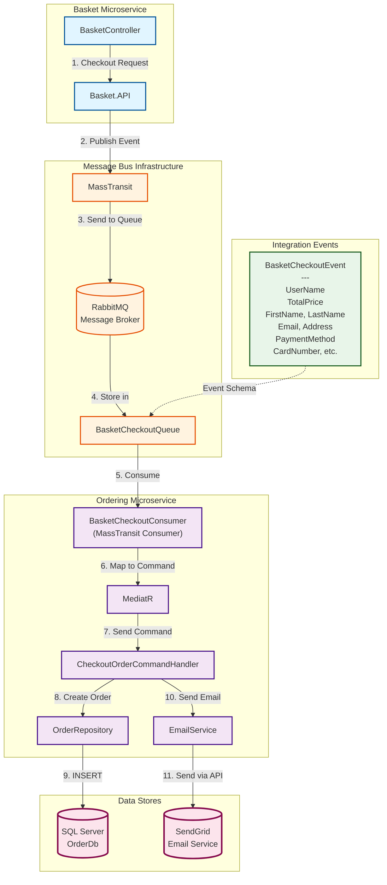
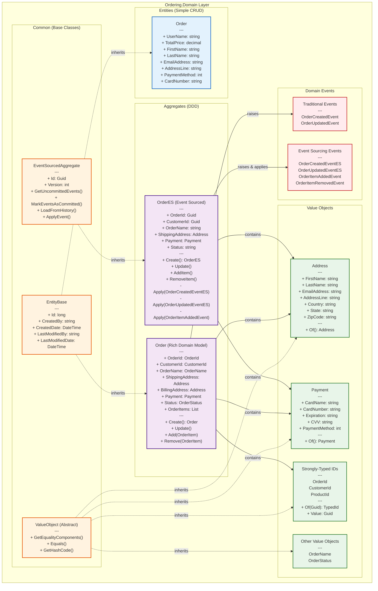
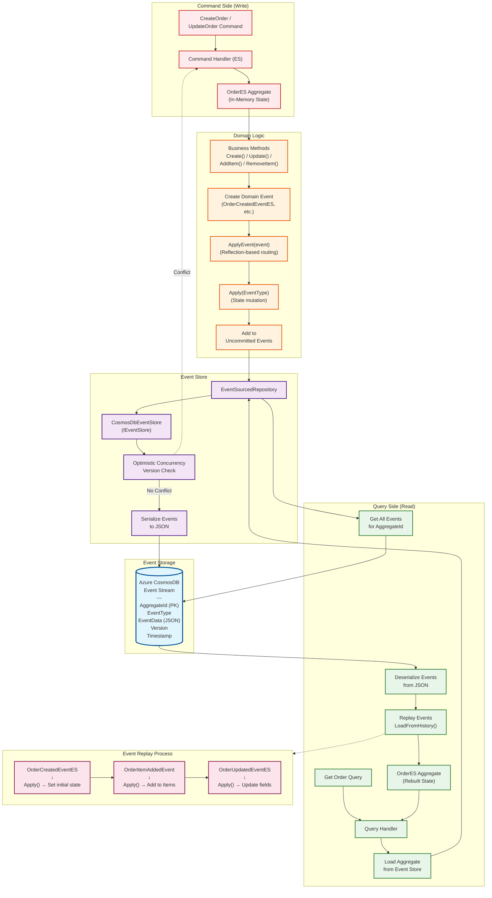
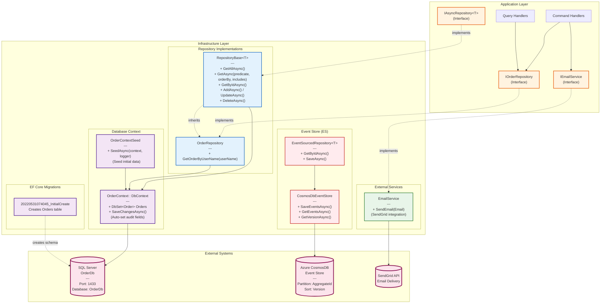
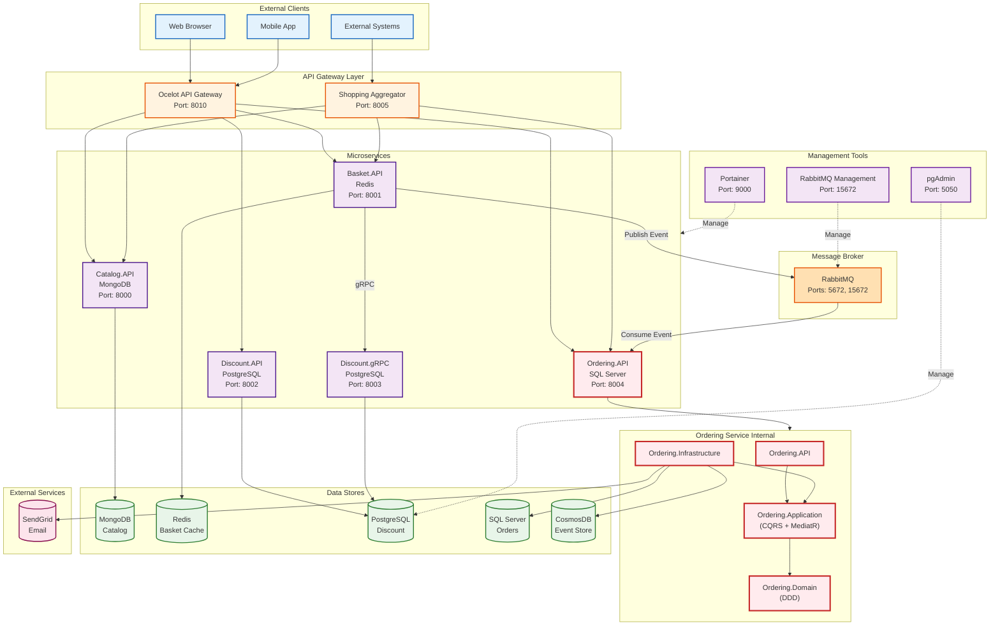

# Ordering Service - Layer Diagrams

This document contains architectural layer diagrams for the Ordering microservice.

## 1. Clean Architecture - Layer Dependencies

```mermaid
graph TB
    subgraph "Ordering Service - Clean Architecture"
        subgraph API["API Layer (Ordering.API)"]
            Controllers["Controllers<br/>- OrderController"]
            Consumers["Event Consumers<br/>- BasketCheckoutConsumer"]
            Extensions["Extensions<br/>- HostExtension"]
            APIMapping["Mapping<br/>- OrderingProfile"]
            Startup["Startup & Configuration"]
        end

        subgraph Application["Application Layer (Ordering.Application)"]
            Commands["Commands<br/>- CheckoutOrderCommand<br/>- UpdateOrderCommand<br/>- DeleteOrderCommand"]
            Queries["Queries<br/>- GetOrdersListQuery"]
            Handlers["Handlers<br/>- Command/Query Handlers"]
            Behaviors["Pipeline Behaviors<br/>- ValidationBehaviour<br/>- UnhandledExceptionBehaviour"]
            Contracts["Contracts (Interfaces)<br/>- IAsyncRepository<br/>- IOrderRepository<br/>- IEmailService"]
            DTOs["Models & DTOs<br/>- OrdersVm<br/>- Email"]
            Validators["Validators<br/>- FluentValidation"]
            AppMapping["Mapping<br/>- MappingProfile"]
        end

        subgraph Domain["Domain Layer (Ordering.Domain)"]
            Entities["Entities<br/>- Order (Simple)"]
            Aggregates["Aggregates (DDD)<br/>- Order (Rich)<br/>- OrderES (Event Sourced)"]
            ValueObjects["Value Objects<br/>- Address<br/>- Payment<br/>- OrderId<br/>- CustomerId"]
            DomainEvents["Domain Events<br/>- OrderCreatedEvent<br/>- OrderUpdatedEvent<br/>- OrderCreatedEventES"]
            Common["Common (Base Classes)<br/>- EntityBase<br/>- ValueObject<br/>- EventSourcedAggregate"]
        end

        subgraph Infrastructure["Infrastructure Layer (Ordering.Infrastructure)"]
            DbContext["Persistence<br/>- OrderContext<br/>- OrderContextSeed"]
            Repositories["Repositories<br/>- RepositoryBase<br/>- OrderRepository"]
            ExternalServices["External Services<br/>- EmailService (SendGrid)"]
            EventStore["Event Store<br/>- CosmosDbEventStore<br/>- EventSourcedRepository"]
            Migrations["EF Migrations"]
        end

        subgraph External["External Dependencies"]
            SQLServer[("SQL Server<br/>OrderDb")]
            RabbitMQ[("RabbitMQ<br/>Message Broker")]
            SendGrid[("SendGrid<br/>Email Service")]
            CosmosDB[("Azure CosmosDB<br/>Event Store")]
        end
    end

    %% Dependencies (outer layers depend on inner layers)
    API --> Application
    API --> Infrastructure
    Application --> Domain
    Infrastructure --> Application
    Infrastructure --> Domain

    %% External dependencies
    Infrastructure --> SQLServer
    Infrastructure --> CosmosDB
    Infrastructure --> SendGrid
    API --> RabbitMQ

    %% Styling
    classDef apiLayer fill:#e1f5ff,stroke:#01579b,stroke-width:2px
    classDef appLayer fill:#f3e5f5,stroke:#4a148c,stroke-width:2px
    classDef domainLayer fill:#fff3e0,stroke:#e65100,stroke-width:2px
    classDef infraLayer fill:#e8f5e9,stroke:#1b5e20,stroke-width:2px
    classDef externalLayer fill:#fce4ec,stroke:#880e4f,stroke-width:2px

    class API apiLayer
    class Application appLayer
    class Domain domainLayer
    class Infrastructure infraLayer
    class External externalLayer
```



## 2. CQRS Pattern - Command and Query Separation

```mermaid
graph LR
    subgraph Client["External Clients"]
        WebApp["Web Application"]
        APIGateway["API Gateway"]
        OtherServices["Other Microservices"]
    end

    subgraph OrderingAPI["Ordering.API"]
        Controller["OrderController"]
        Consumer["BasketCheckoutConsumer"]
    end

    subgraph MediatR["MediatR Pipeline"]
        Mediator["Mediator"]
        ValidationPipeline["Validation Pipeline"]
        ExceptionPipeline["Exception Pipeline"]
    end

    subgraph Commands["Write Side (Commands)"]
        CheckoutCmd["CheckoutOrderCommand"]
        UpdateCmd["UpdateOrderCommand"]
        DeleteCmd["DeleteOrderCommand"]

        CheckoutHandler["CheckoutOrderCommandHandler"]
        UpdateHandler["UpdateOrderCommandHandler"]
        DeleteHandler["DeleteOrderCommandHandler"]

        WriteRepo["IOrderRepository (Write)"]
    end

    subgraph Queries["Read Side (Queries)"]
        GetOrdersQuery["GetOrdersListQuery"]

        GetOrdersHandler["GetOrderListQueryHandler"]

        ReadRepo["IOrderRepository (Read)"]
    end

    subgraph Database["Data Store"]
        WriteDB[("SQL Server<br/>Write Operations<br/>Tracking Enabled")]
        ReadDB[("SQL Server<br/>Read Operations<br/>AsNoTracking")]
    end

    %% Client flows
    WebApp -->|POST/PUT/DELETE| Controller
    APIGateway -->|HTTP Requests| Controller
    OtherServices -->|Events via RabbitMQ| Consumer

    WebApp -->|GET| Controller

    %% Command flow
    Controller -->|Send Command| Mediator
    Consumer -->|Send Command| Mediator
    Mediator -->|Write Operation| ValidationPipeline
    ValidationPipeline -->|Validate| ExceptionPipeline

    ExceptionPipeline --> CheckoutCmd
    ExceptionPipeline --> UpdateCmd
    ExceptionPipeline --> DeleteCmd

    CheckoutCmd --> CheckoutHandler
    UpdateCmd --> UpdateHandler
    DeleteCmd --> DeleteHandler

    CheckoutHandler --> WriteRepo
    UpdateHandler --> WriteRepo
    DeleteHandler --> WriteRepo

    WriteRepo -->|INSERT/UPDATE/DELETE| WriteDB

    %% Query flow
    Controller -->|Send Query| Mediator
    Mediator -->|Read Operation| GetOrdersQuery
    GetOrdersQuery --> GetOrdersHandler
    GetOrdersHandler --> ReadRepo
    ReadRepo -->|SELECT| ReadDB

    %% Styling
    classDef clientStyle fill:#e3f2fd,stroke:#1565c0,stroke-width:2px
    classDef writeStyle fill:#ffebee,stroke:#c62828,stroke-width:2px
    classDef readStyle fill:#e8f5e9,stroke:#2e7d32,stroke-width:2px
    classDef mediatorStyle fill:#fff3e0,stroke:#ef6c00,stroke-width:2px
    classDef dbStyle fill:#f3e5f5,stroke:#6a1b9a,stroke-width:3px

    class WebApp,APIGateway,OtherServices clientStyle
    class CheckoutCmd,UpdateCmd,DeleteCmd,CheckoutHandler,UpdateHandler,DeleteHandler,WriteRepo,WriteDB writeStyle
    class GetOrdersQuery,GetOrdersHandler,ReadRepo,ReadDB readStyle
    class Mediator,ValidationPipeline,ExceptionPipeline mediatorStyle
```



## 3. Event-Driven Architecture - Integration Events



## 4. Domain-Driven Design - Domain Layer Structure



## 5. Event Sourcing Architecture



## 6. Infrastructure Layer - Data Access



## 7. MediatR Pipeline - Cross-Cutting Concerns

```mermaid
graph LR
    subgraph Request["Incoming Request"]
        TRequest["TRequest<br/>(Command or Query)"]
    end

    subgraph Pipeline["MediatR Pipeline Behaviors"]
        Behavior1["UnhandledExceptionBehaviour<br/>---<br/>1. Wrap in try-catch<br/>2. Log exceptions<br/>3. Re-throw"]

        Behavior2["ValidationBehaviour<br/>---<br/>1. Get all IValidator&lt;TRequest&gt;<br/>2. Run validations<br/>3. Collect failures<br/>4. Throw if any failures"]
    end

    subgraph Handler["Request Handler"]
        ActualHandler["IRequestHandler&lt;TRequest, TResponse&gt;<br/>---<br/>Business logic execution"]
    end

    subgraph Response["Response"]
        TResponse["TResponse<br/>(Result)"]
        ValidationEx["ValidationException<br/>(400 Bad Request)"]
        Exception["Exception<br/>(500 Internal Server Error)"]
    end

    TRequest --> Behavior1
    Behavior1 -->|await next()| Behavior2
    Behavior2 -->|Validation passed| ActualHandler
    Behavior2 -.->|Validation failed| ValidationEx

    ActualHandler -->|Success| TResponse
    ActualHandler -.->|Unhandled error| Behavior1
    Behavior1 -.->|Logged & re-thrown| Exception

    %% Styling
    classDef requestStyle fill:#e3f2fd,stroke:#1565c0,stroke-width:2px
    classDef pipelineStyle fill:#fff3e0,stroke:#e65100,stroke-width:2px
    classDef handlerStyle fill:#e8f5e9,stroke:#2e7d32,stroke-width:2px
    classDef successStyle fill:#f3e5f5,stroke:#4a148c,stroke-width:2px
    classDef errorStyle fill:#ffebee,stroke:#c62828,stroke-width:2px

    class TRequest requestStyle
    class Behavior1,Behavior2 pipelineStyle
    class ActualHandler handlerStyle
    class TResponse successStyle
    class ValidationEx,Exception errorStyle
```

## 8. Complete System Architecture - Microservices Context



## 9. Data Flow - Traditional CRUD vs Event Sourcing

```mermaid
graph TB
    subgraph Traditional["Traditional CRUD Approach"]
        TraditionalAPI["API Request"]
        TraditionalCommand["Command"]
        TraditionalHandler["Command Handler"]
        TraditionalRepo["Repository"]
        TraditionalEF["Entity Framework"]
        TraditionalDB[("SQL Server<br/>Current State Only<br/>---<br/>Orders Table<br/>Latest values")]

        TraditionalAPI --> TraditionalCommand
        TraditionalCommand --> TraditionalHandler
        TraditionalHandler --> TraditionalRepo
        TraditionalRepo --> TraditionalEF
        TraditionalEF -->|UPDATE/INSERT| TraditionalDB

        Note1["❌ Lost History<br/>❌ No Audit Trail<br/>❌ Can't replay events<br/>✅ Simple queries<br/>✅ Familiar pattern"]
    end

    subgraph EventSourced["Event Sourcing Approach"]
        ESApi["API Request"]
        ESCommand["Command"]
        ESHandler["Command Handler (ES)"]
        ESAggregate["OrderES Aggregate"]
        ESDomainEvent["Domain Event"]
        ESRepo["EventSourcedRepository"]
        ESStore["CosmosDbEventStore"]
        ESCosmosDB[("CosmosDB<br/>Event Stream<br/>---<br/>OrderCreatedEventES<br/>OrderUpdatedEventES<br/>OrderItemAddedEvent<br/>...all events")]

        ESProjection["Projection<br/>(Future: Read Model)"]
        ESReadDB[("Read Database<br/>Materialized Views")]

        ESApi --> ESCommand
        ESCommand --> ESHandler
        ESHandler --> ESAggregate
        ESAggregate --> ESDomainEvent
        ESDomainEvent --> ESRepo
        ESRepo --> ESStore
        ESStore -->|Append Events| ESCosmosDB

        ESCosmosDB -.->|Event replay| ESAggregate
        ESCosmosDB -.->|Project| ESProjection
        ESProjection -.->|Materialize| ESReadDB

        Note2["✅ Full Audit History<br/>✅ Time Travel<br/>✅ Event Replay<br/>✅ Temporal Queries<br/>❌ Complex queries<br/>❌ Learning curve"]
    end

    %% Styling
    classDef traditionalStyle fill:#e3f2fd,stroke:#1565c0,stroke-width:2px
    classDef esStyle fill:#ffebee,stroke:#c62828,stroke-width:2px
    classDef noteStyle fill:#fff3e0,stroke:#e65100,stroke-width:2px

    class TraditionalAPI,TraditionalCommand,TraditionalHandler,TraditionalRepo,TraditionalEF,TraditionalDB traditionalStyle
    class ESApi,ESCommand,ESHandler,ESAggregate,ESDomainEvent,ESRepo,ESStore,ESCosmosDB,ESProjection,ESReadDB esStyle
    class Note1,Note2 noteStyle
```



---

## Tools for Viewing

These Mermaid diagrams can be viewed in:
- **GitHub** (native support)
- **Visual Studio Code** (with Mermaid extension: `bierner.markdown-mermaid`)
- **Online**: https://mermaid.live/
- **Markdown Preview Enhanced** (VS Code extension)
- **Any Markdown viewer with Mermaid support**

## Diagram Descriptions

1. **Clean Architecture Layer Dependencies** - Shows the 4-layer architecture and dependency rules
2. **CQRS Pattern** - Illustrates command/query separation with MediatR
3. **Event-Driven Architecture** - Integration events flow via RabbitMQ
4. **DDD Domain Layer Structure** - Domain entities, aggregates, value objects, and inheritance
5. **Event Sourcing Architecture** - Write/read sides with event store and replay
6. **Infrastructure Layer** - Repository pattern, DbContext, and external service integrations
7. **MediatR Pipeline** - Cross-cutting concerns (validation, exception handling)
8. **Complete System Architecture** - Entire microservices ecosystem with Ordering service highlighted
9. **Traditional CRUD vs Event Sourcing** - Comparison of both approaches with trade-offs
