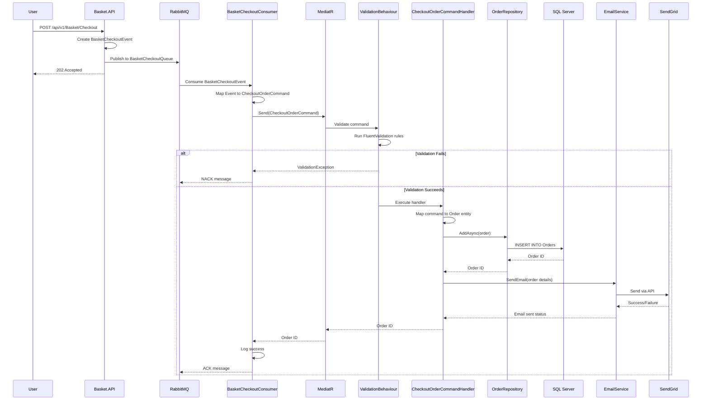
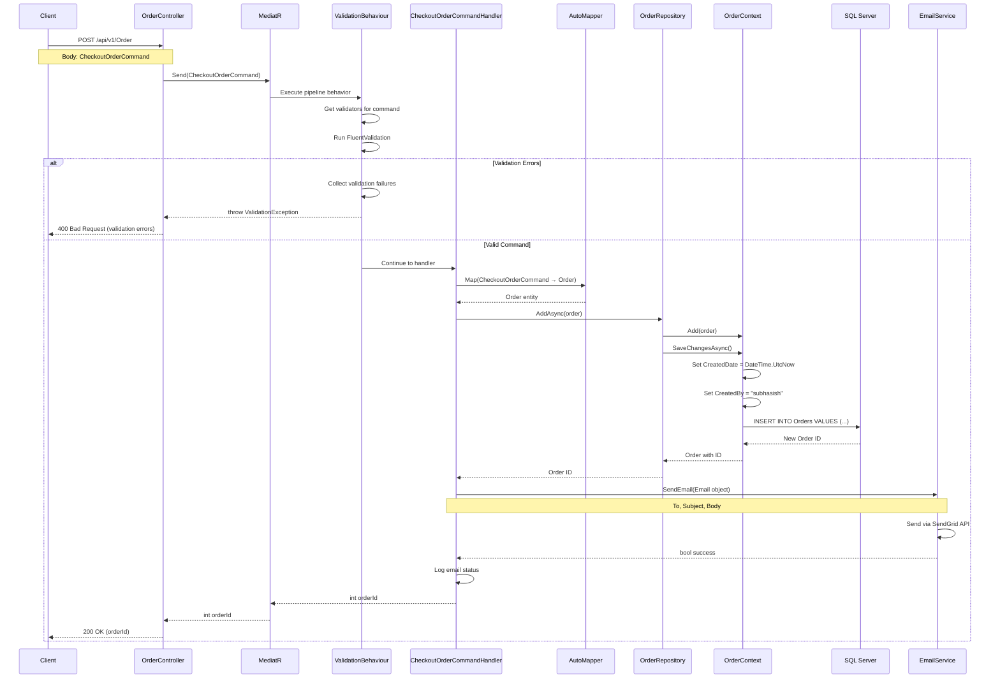
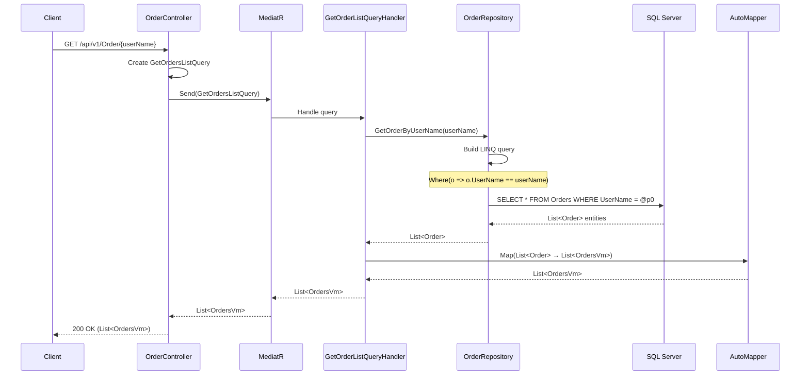
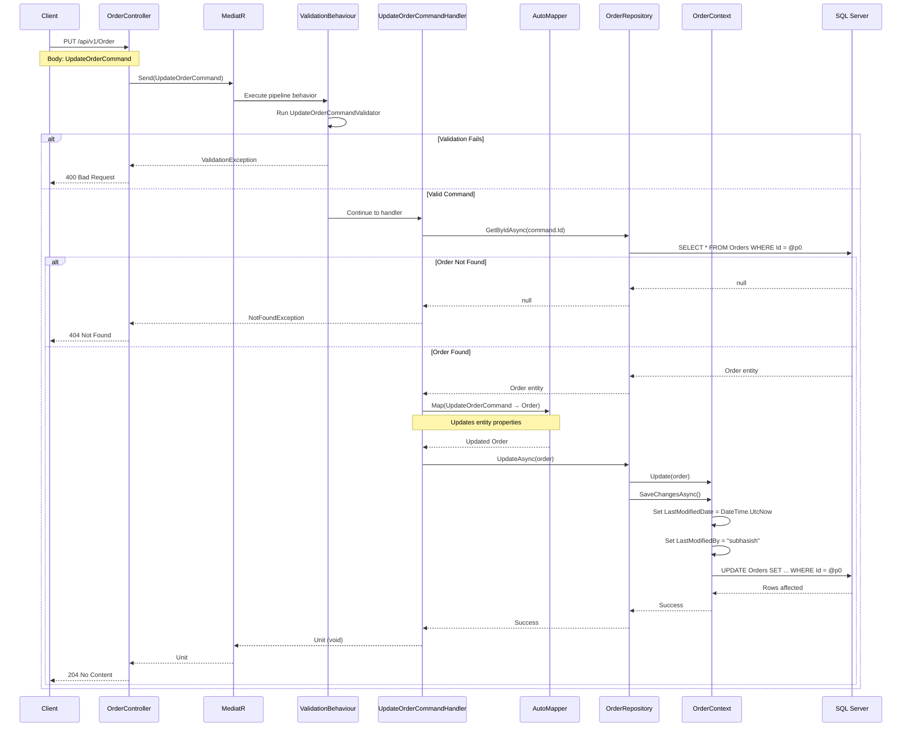
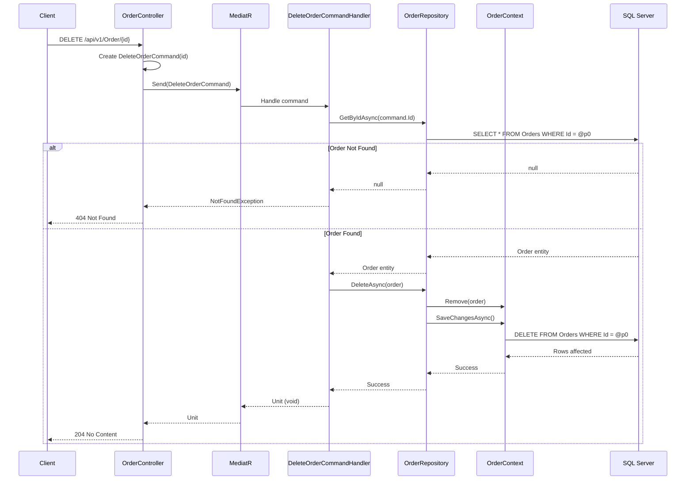
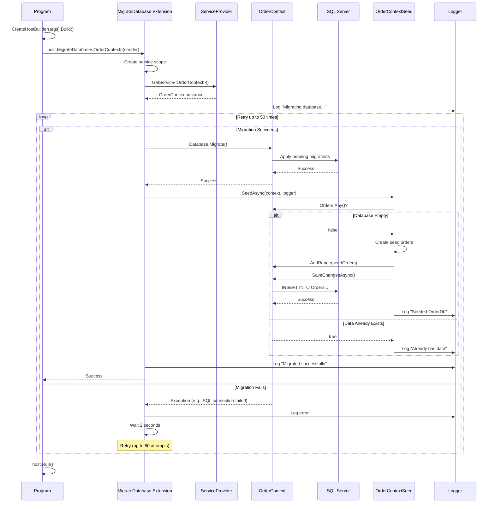
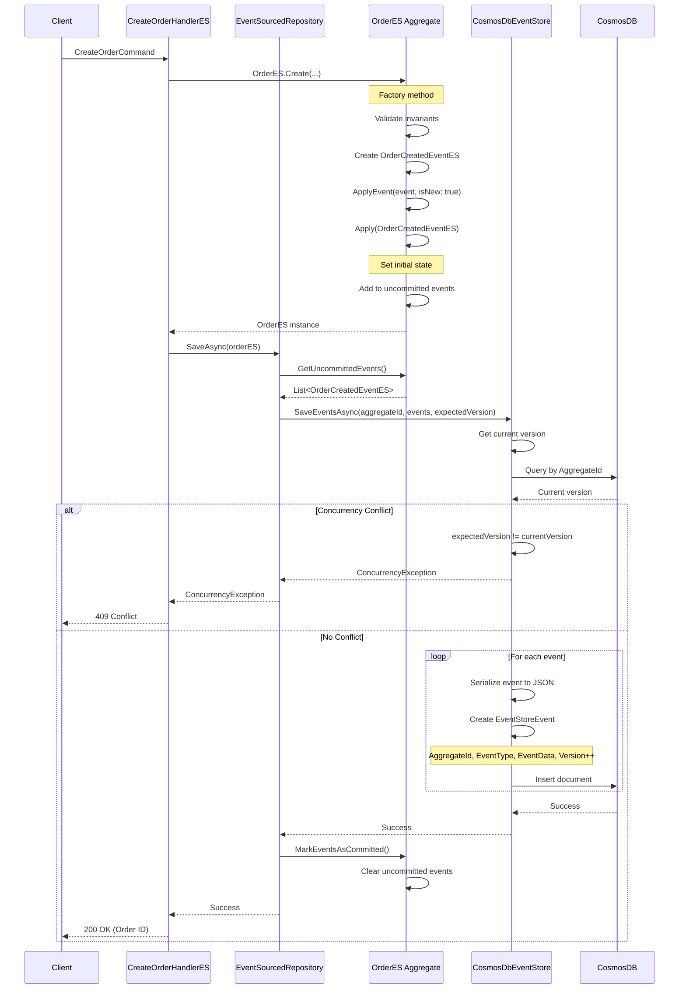
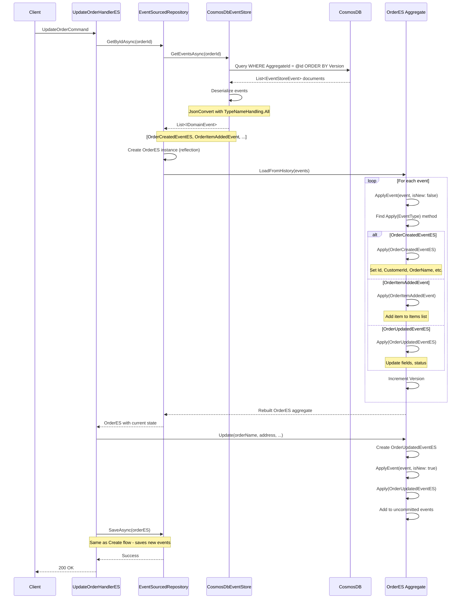
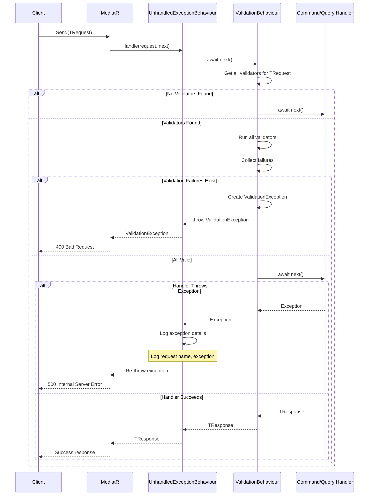
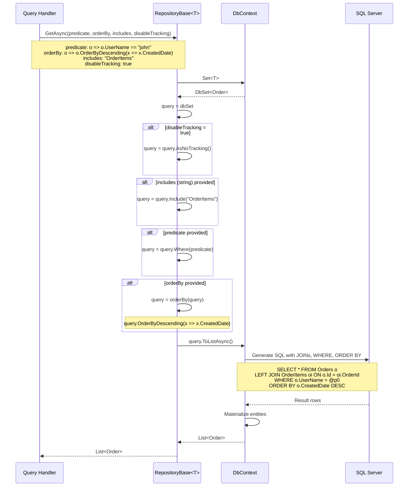

# Ordering Service - Sequence Diagrams

This document contains sequence diagrams for key flows in the Ordering microservice.

## 1. Basket Checkout to Order Creation Flow

## 2. Create Order Command Flow (Direct API Call)

## 3. Get Orders by Username Query Flow

## 4. Update Order Command Flow

## 5. Delete Order Command Flow

## 6. Database Migration on Application Startup

## 7. Event Sourcing - Create Order Flow (Advanced Implementation)

## 8. Event Sourcing - Load Order from Events Flow

## 9. MediatR Pipeline Behavior Flow

## 10. Repository Pattern - Query with Includes and Ordering

---

## Legend

- **Solid arrows (→)**: Synchronous calls
- **Dashed arrows (-->>)**: Return values/responses
- **Note boxes**: Additional context or important details
- **alt/else blocks**: Conditional flows
- **loop blocks**: Iterative processes

## Tools for Viewing

These Mermaid diagrams can be viewed in:
- GitHub (native support)
- Visual Studio Code (with Mermaid extension)
- Online: https://mermaid.live/
- Any Markdown viewer with Mermaid support
